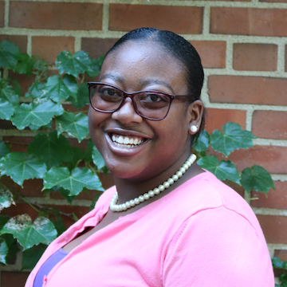

This is the 2nd summer REU hosted by CSAFE at Iowa State University. 

The website for the first REU summer is [here](https://csafe-isu.github.io/reu17/)

This summer, the six students will be working on either a [human factors](https://forensicstats.org/our-research/human-factors/) or a [handwriting analysis](https://forensicstats.org/our-research/statistical-foundations/handwriting-question-document-analysis/) project. They will be using statistical methods to investigate variables influencing mock jurors' verdicts, and to automatically classify handwrittend characters. More detail will be posted as it becomes available. 

This summer, our six outstanding students represent their home institutions of [Iowa State University](https://www.iastate.edu/) (ISU), [Albany State University](https://www.asurams.edu/archives/east/natural-sciences/) (ASU), and [Fayettesville State University](https://www.uncfsu.edu/academics/colleges-schools-and-departments/college-of-arts-and-sciences/department-of-biological-sciences/forensic-science-(bs)) (FSU). Both ASU and FSU are HBCUs and CSAFE partner institutions. ISU is the home institution of CSAFE.  

## 2018 Students 

|  | Badiah Hannon is a rising senior at Fayetteville State University in Fayetteville, North Carolina. She is a Forensic Science major with a concentration in biology and a minor in chemistry. She will be graduating in May 2019 and plans to attend graduate school to obtain a Master's in Microbiology and Immunology and a Doctorate in Pathology. | | | 
|  | Malisha Jones is a 20 year old rising senior at Albany State University majoring in Forensic Science with a dual minor in Chemistry and Criminal Justice. Malisha is originally from Albany, Georgia, and hopes to pursue her PhD in Forensic Science. | | |
|  | Carley McConnell is a senior majoring in Chemistry with minors in Criminal Justice and Biology at Iowa State University. She will also obtain a certificate in Crime Scene Investigation from Des Moin Area Community College in the fall. She plans have a career in forensic science, either as a crime scene investigator or as a forensic technician.  | | |
|  | Da'Monie McRae, is a rising junior at Albany State University, double majoring in Chemistry and Forensic Science. She plans to pursue a career with the Department of Defense as a Forensic Chemist. | | | 
 | Yolonda Miller is a forensic science major at Fayetteville State University. Yolonda's interests are crime scene investigation and handwriting analysis. A member of the Class of 2020, Yolonda wants to pursue a Master's degree in a forensic science field. | | |
